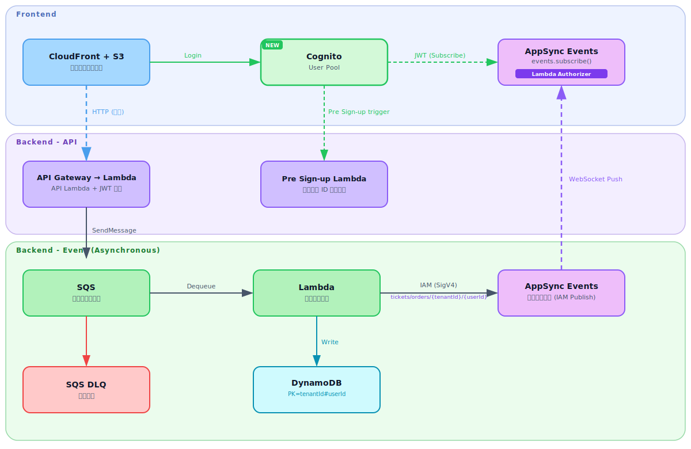

# realtime-event-platform

> English version: [README.md](README.md)

## 概要

AWS AppSync Subscription を用いたイベント駆動アーキテクチャのリファレンス実装。
ポーリングを廃止し、SQS → Lambda → AppSync Mutation によるリアルタイム Push をフロントエンドに配信する。

---

## アーキテクチャ



---

## 技術スタック

| レイヤー            | 技術                                              |
| ------------------- | ------------------------------------------------- |
| フロントエンド      | Vite (SPA) / React / TypeScript / aws-amplify v6  |
| バックエンド API    | Go / API Gateway / Lambda                         |
| バックエンド Lambda | Go / SQS トリガー / AppSync Mutation              |
| メッセージング      | Amazon SQS (DLQ 付き)                             |
| リアルタイム Push   | AWS AppSync (GraphQL Subscription over WebSocket) |
| インフラ            | AWS CDK (TypeScript)                              |
| CI/CD               | GitHub Actions                                    |

---

## ディレクトリ構成

```text
realtime-event-platform/
├── frontend/                    # Vite + React + TypeScript (FSD)
│   ├── src/
│   └── public/
│
├── backend/                     # Go Lambda — 統合モジュール
│   ├── cmd/
│   │   ├── api/main.go          # API Lambda エントリポイント
│   │   └── event/main.go        # Event Lambda エントリポイント
│   ├── internal/
│   │   ├── handler/
│   │   │   ├── api/             # REST ハンドラー → producer
│   │   │   └── event/           # SQS ハンドラー → notifier
│   │   └── library/
│   │       ├── config/          # 環境設定
│   │       ├── producer/        # SQS SendMessage クライアント
│   │       ├── notifier/        # AppSync Mutation クライアント
│   │       └── store/           # DynamoDB クライアント
│   ├── tools/                   # ローカル開発ツール・テストイベント
│   └── go.mod
│
└── infra/                       # AWS CDK (TypeScript)
    ├── bin/app.ts               # CDK App エントリポイント
    ├── lib/
    │   ├── stacks/              # スタック定義
    │   └── constructs/          # L3 カスタムコンストラクト (リソース単位で分割)
    ├── config/env-config.ts     # EnvConfig 型 + 環境定数
    ├── test/                    # CDK スナップショット / ユニットテスト (Jest)
    └── cdk.json
```

---

## セットアップ手順

### 前提条件

- Node.js 24.x (asdf で管理)
- Go 1.26.x ([asdf](https://asdf-vm.com/) で管理)
- AWS CDK CLI (`npm install -g aws-cdk`)
- AWS CLI (適切なクレデンシャルで設定済み)

### Frontend

```bash
cd frontend

# .env.example を .env.local にコピー
make setup-tools

# 依存関係のインストール
make install

# 開発サーバーを起動 (http://localhost:5173)
make up

# コードの品質チェック (Prettier → ビルド → ESLint)
make verify
```

### Backend (API)

```bash
cd backend

# 開発サーバを起動 (http://localhost:18080)
make up

# コードの品質チェック (フォーマット → ビルド → Lint → テスト)
make verify
```

### Backend (Lambda)

```bash
cd backend

# Lambda をローカル環境で実行するためのツールをインストール
make setup-tools

# 別ターミナルで実行 (Lambda待ち受け)
make run-event

# イベントを送信 (Lambda 起動後、別ターミナルで実行)
make invoke-event

# 別のイベントファイルを指定する場合
make invoke-event EVENT_FILE=tools/events/sqs_event.json
```

### Infrastructure

```bash
cd infra
npm install

# AWS SSO 認証 (トークン期限切れ時も再実行)
aws sso login --profile <your-profile>

# 初回のみ — AWS アカウントに CDK ツールキットをセットアップ
make bootstrap AWS_PROFILE=<your-profile>

# CloudFormation テンプレートの合成
make synth AWS_PROFILE=<your-profile>

# デプロイ済みスタックとの差分確認
make diff AWS_PROFILE=<your-profile>

# AWS へデプロイ
make deploy AWS_PROFILE=<your-profile>
```

---

## Deployment

Lambda のコード更新とインフラ変更は独立して管理する。

### Backend (API・Lambda)

CDK はインフラ定義のみを管理する。Lambda バイナリの更新は `backend/Makefile` のコマンドで行う。

```bash
cd backend

# ビルド → S3 アップロード → Lambda 反映を一括実行
make deploy-lambda AWS_PROFILE=<your-profile> ENV=<env>

# 個別に実行する場合
make upload-api AWS_PROFILE=<your-profile>    # API Lambda を S3 にアップロード
make upload-event AWS_PROFILE=<your-profile>  # Event Lambda を S3 にアップロード
make deploy-api AWS_PROFILE=<your-profile>    # API Lambda のコードを更新
make deploy-event AWS_PROFILE=<your-profile>  # Event Lambda のコードを更新
```

アップロード先の S3 パス:

```text
{ENV}-realtime-event-storage/
  └── artifacts/
      ├── api/bootstrap.zip
      └── event/bootstrap.zip
```

### Frontend (S3+CloudFront)

```bash
cd frontend

# ビルド → S3 アップロード → CloudFront キャッシュ無効化を一括実行
make deploy AWS_PROFILE=<your-profile> CF_DISTRIBUTION_ID=<distribution-id>

# 個別に実行する場合
make build                               # Prettier フォーマット + ビルド
make upload AWS_PROFILE=<your-profile>   # dist/ を S3 にアップロード
```

アップロード先の S3 パス:

```text
{ENV}-realtime-event-frontend/
  └── (Vite ビルド成果物)
```
