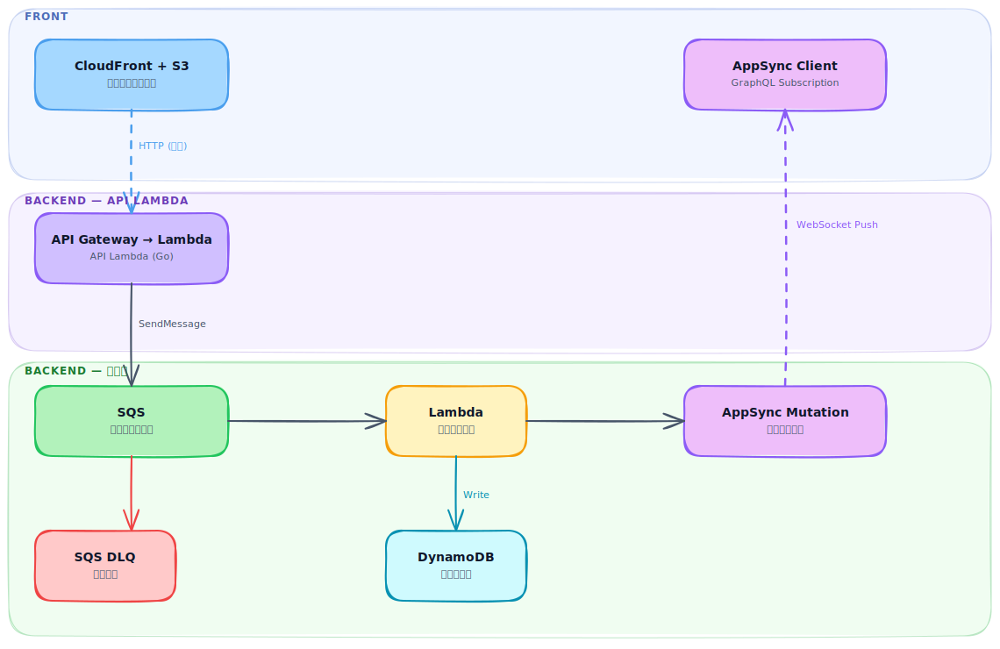

# realtime-event-platform

> English version: [README.md](README.md)

## 概要

AWS AppSync Subscription を用いたイベント駆動アーキテクチャのリファレンス実装。
ポーリングを廃止し、SQS → Lambda → AppSync Mutation によるリアルタイム Push をフロントエンドに配信する。

## アーキテクチャ



## 技術スタック

| レイヤー            | 技術                                              |
| ------------------- | ------------------------------------------------- |
| フロントエンド      | Vite (SPA) / React / TypeScript / aws-amplify v6  |
| バックエンド API    | Go / API Gateway / Lambda                         |
| バックエンド Lambda | Go / SQS トリガー / AppSync Mutation              |
| メッセージング      | Amazon SQS (DLQ 付き)                             |
| リアルタイム Push   | AWS AppSync (GraphQL Subscription over WebSocket) |
| インフラ            | AWS CDK (TypeScript)                              |
| CI/CD               | GitHub Actions                                    |

## ディレクトリ構成

```text
realtime-event-platform/
├── frontend/                    # Vite + React + TypeScript (FSD)
│   └── src/
│       ├── app/                 # プロバイダー・ルーター・グローバル設定
│       ├── pages/               # ページコンポーネント
│       ├── widgets/             # 複合 UI ブロック
│       ├── features/            # フィーチャースライス (events/, auth/)
│       └── shared/              # 共通ユーティリティ・GraphQL codegen
│
├── backend/                     # Go Lambda — 統合モジュール
│   ├── cmd/
│   │   ├── api/main.go          # API Lambda エントリポイント
│   │   └── event/main.go        # Event Lambda エントリポイント
│   ├── internal/
│   │   ├── handler/
│   │   │   ├── api/             # REST ハンドラー → publisher
│   │   │   └── event/           # SQS ハンドラー → notifier
│   │   ├── library/
│   │   │   ├── publisher/       # SQS SendMessage クライアント
│   │   │   └── notifier/        # AppSync Mutation クライアント
│   │   └── types/
│   ├── go.mod
│   └── Makefile
│
├── infra/                       # AWS CDK (TypeScript)
│   ├── bin/app.ts               # CDK App エントリポイント — devConfig を渡してスタックをインスタンス化
│   ├── lib/
│   │   ├── stacks/              # スタック定義
│   │   └── constructs/          # L3 カスタムコンストラクト (リソース単位で分割)
│   ├── config/env-config.ts     # EnvConfig 型 + devConfig (stg/prd は定数を追加するだけ)
│   ├── test/                    # CDK スナップショット / ユニットテスト (Jest)
│   ├── cdk.json
│   └── Makefile
│
├── .github/
│   ├── workflows/               # CI/CD ワークフロー
│   └── PULL_REQUEST_TEMPLATE.md
│
└── docs/
    ├── README.md
    └── README.ja.md
```

## セットアップ手順

### 前提条件

- Go 1.24.x ([asdf](https://asdf-vm.com/) で管理)
- Node.js 24.x (asdf で管理)
- AWS CDK CLI (`npm install -g aws-cdk`)
- AWS CLI (適切なクレデンシャルで設定済み)

### バックエンド

```bash
cd backend

# API Lambda バイナリをビルド
make build-api

# Event Lambda バイナリをビルド
make build-event
```

### フロントエンド

```bash
cd frontend
npm install
npm run dev
```

### インフラ

```bash
cd infra
npm install

# AWS SSO 認証 (トークン期限切れ時も再実行)
aws sso login --profile <your-profile>

# 初回のみ — AWS アカウントに CDK ツールキットをセットアップ
make bootstrap AWS_PROFILE=<your-profile>

# CloudFormation テンプレートの合成
make synth AWS_PROFILE=<your-profile>

# デプロイ済みスタックとの差分確認
make diff AWS_PROFILE=<your-profile>

# AWS へデプロイ
make deploy AWS_PROFILE=<your-profile>
```
