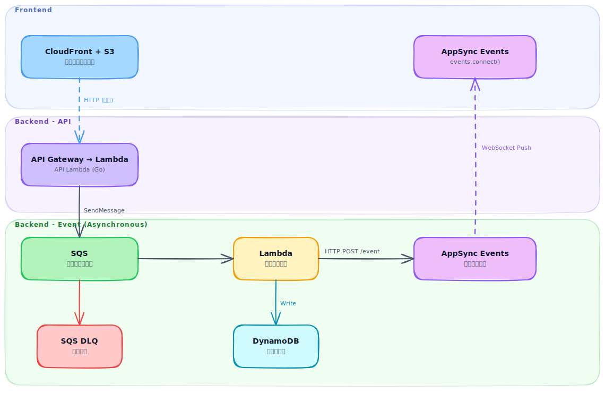

# realtime-event-platform

> 日本語版: [README.ja.md](README.ja.md)

## Overview

Reference implementation of an event-driven architecture using AWS AppSync Subscription.
Eliminates polling by delivering real-time push notifications to the frontend via SQS → Lambda → AppSync Mutation.

---

## Architecture



---

## Tech Stack

| Layer          | Technology                                        |
| -------------- | ------------------------------------------------- |
| Frontend       | Vite (SPA) / React / TypeScript / aws-amplify v6  |
| Backend API    | Go / API Gateway / Lambda                         |
| Backend Lambda | Go / SQS trigger / AppSync Mutation               |
| Messaging      | Amazon SQS (with DLQ)                             |
| Realtime Push  | AWS AppSync (GraphQL Subscription over WebSocket) |
| Infra          | AWS CDK (TypeScript)                              |
| CI/CD          | GitHub Actions                                    |

---

## Directory Structure

```text
realtime-event-platform/
├── frontend/                    # Vite + React + TypeScript (FSD)
│   ├── src/
│   └── public/
│
├── backend/                     # Go Lambda — unified module
│   ├── cmd/
│   │   ├── api/main.go          # API Lambda entrypoint
│   │   └── event/main.go        # Event Lambda entrypoint
│   ├── internal/
│   │   ├── handler/
│   │   │   ├── api/             # REST handler → producer
│   │   │   └── event/           # SQS handler → notifier
│   │   └── library/
│   │       ├── config/          # Environment config
│   │       ├── producer/        # SQS SendMessage client
│   │       ├── notifier/        # AppSync Mutation client
│   │       └── store/           # DynamoDB client
│   ├── tools/                   # Local dev tools & test events
│   └── go.mod
│
└── infra/                       # AWS CDK (TypeScript)
    ├── bin/app.ts               # CDK App entrypoint
    ├── lib/
    │   ├── stacks/              # Stack definitions
    │   └── constructs/          # L3 custom constructs (one file per resource)
    ├── config/env-config.ts     # EnvConfig type + environment constants
    ├── test/                    # CDK snapshot / unit tests (Jest)
    └── cdk.json
```

---

## Getting Started

### Prerequisites

- Node.js 24.x (managed via asdf)
- Go 1.26.x (managed via [asdf](https://asdf-vm.com/))
- AWS CDK CLI (`npm install -g aws-cdk`)
- AWS CLI (configured with appropriate credentials)

### Frontend

```bash
cd frontend

# Copy .env.example to .env.local
make setup-tools

# Install dependencies
make install

# Start dev server (http://localhost:5173)
make up

# Code quality checks (Prettier → build → ESLint)
make verify
```

### Backend (API)

```bash
cd backend

# Start dev server (http://localhost:18080)
make up

# Code quality checks (format → build → lint → test)
make verify
```

### Backend (Lambda)

```bash
cd backend

# Install tools for running Lambda locally
make setup-tools

# Start Lambda listener in a separate terminal
make run-event

# Send a test event (run in another terminal after Lambda is ready)
make invoke-event

# Specify a different event file
make invoke-event EVENT_FILE=tools/events/sqs_event.json
```

### Infrastructure

```bash
cd infra
npm install

# Authenticate with AWS SSO (re-run when token expires)
aws sso login --profile <your-profile>

# First time only — sets up CDK toolkit in AWS account
make bootstrap AWS_PROFILE=<your-profile>

# Synthesize CloudFormation template
make synth AWS_PROFILE=<your-profile>

# Preview changes against deployed stack
make diff AWS_PROFILE=<your-profile>

# Deploy to AWS
make deploy AWS_PROFILE=<your-profile>
```

---

## Deployment

### Backend (API & Lambda)

CDK manages only infrastructure definitions. Lambda binary updates are handled via `backend/Makefile`.

```bash
cd backend

# Build → upload to S3 → update Lambda in one command
make deploy-lambda AWS_PROFILE=<your-profile> ENV=<env>

# Run individually
make upload-api AWS_PROFILE=<your-profile>    # Upload API Lambda to S3
make upload-event AWS_PROFILE=<your-profile>  # Upload Event Lambda to S3
make deploy-api AWS_PROFILE=<your-profile>    # Update API Lambda code
make deploy-event AWS_PROFILE=<your-profile>  # Update Event Lambda code
```

S3 upload paths:

```text
{ENV}-realtime-event-storage/
  └── artifacts/
      ├── api/bootstrap.zip
      └── event/bootstrap.zip
```

### Frontend (S3 + CloudFront)

```bash
cd frontend

# Build → upload to S3 → invalidate CloudFront cache in one command
make deploy AWS_PROFILE=<your-profile> CF_DISTRIBUTION_ID=<distribution-id>

# Run individually
make build                               # Prettier format + build
make upload AWS_PROFILE=<your-profile>   # Sync dist/ to S3
```

S3 upload path:

```text
{ENV}-realtime-event-frontend/
  └── (Vite build artifacts)
```
